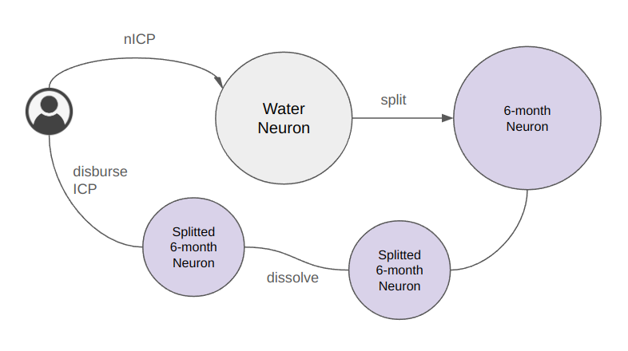

# Unstake nICP to ICP

<figure><figcaption></figcaption></figure>

At any time, you have the option to un-stake your nICP back to ICP. The protocol will facilitate this by splitting the neuron and allocating the appropriate amount of ICP based on the prevailing exchange rate. However, you must wait for the minimum dissolve delay of 6 months to pass. After this period has elapsed, the corresponding ICP will be deposited into your wallet.
